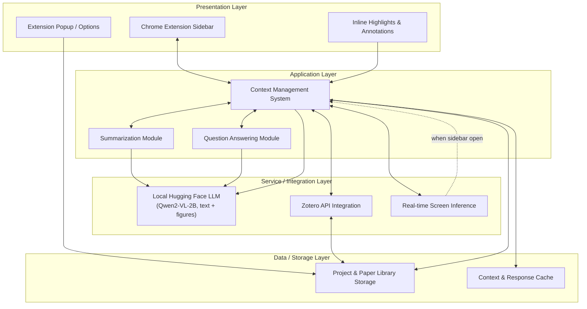
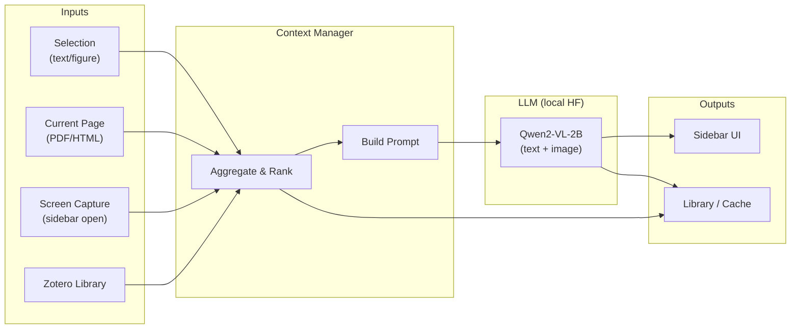
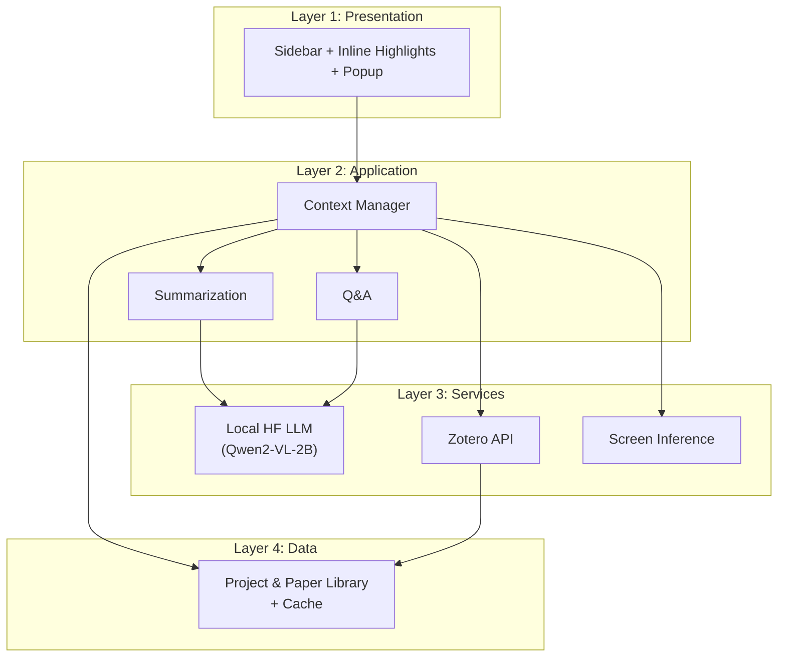

# BioScriptAI v2.0 — High-Level Architecture

A Chrome extension with a persistent sidebar for context-aware academic paper assistance. This document describes the layered architecture, components, data flows, and main APIs.

---

## 1. Layered Architecture Diagram

---

## 2. Component Descriptions

| Layer | Component | Description |
|-------|-----------|-------------|
| **Presentation** | **Chrome Extension Sidebar** | Persistent panel (side panel API or offscreen doc) showing paper context, chat, summaries, and Q&A. Stays open while user browses PDFs or article pages. |
| **Presentation** | **Inline Highlights** | Content scripts inject highlight overlays on selected text/figures; selections are sent to context manager and can trigger summarization or Q&A. |
| **Presentation** | **Extension Popup** | Settings, Zotero connection, project/library selection, and optional quick actions. |
| **Application** | **Context Management System** | Central orchestrator: gathers current page content, selection, active project, relevant papers from library, and screen inference output into a unified context for the LLM. |
| **Application** | **Summarization Module** | Requests section/paragraph/figure summaries from the LLM; consumes context (text + optional figure crops) and returns structured summaries to the sidebar. |
| **Application** | **Question Answering Module** | Handles user questions in the sidebar; uses full context (paper + library + inference) and returns answers with optional citations. |
| **Service** | **Multimodal LLM Interface** | **For demo:** local Hugging Face model ([Qwen2-VL-2B-Instruct](https://huggingface.co/Qwen/Qwen2-VL-2B-Instruct)) run via a local inference server. Single interface: accepts text + image inputs (figures, screenshots) and returns text (and optionally structured JSON). Easy to swap for another HF model or cloud API later. |
| **Service** | **Zotero API Integration** | Syncs references and metadata from user's Zotero library; maps papers to PDFs/URLs and feeds the project and paper library storage. |
| **Service** | **Real-time Screen Inference** | When sidebar is open, captures visible viewport (screenshot or DOM snapshot) and optionally runs lightweight inference (e.g. section detection, key terms) to enrich context. |
| **Storage** | **Project & Paper Library Storage** | Local (IndexedDB / Chrome storage) or optional backend: projects, paper metadata, PDF paths, annotations, and link to Zotero items. |

---

## 3. Data Flows

### 3.1 Main flows

1. **Selection → Answer / Summary**  
   User selects text or figure → content script sends to context manager → context manager enriches with project/library/screen → LLM (summarization or QA) → response rendered in sidebar; optional cache for same context.

2. **Sidebar open → Screen inference**  
   Sidebar open on a tab → service worker or offscreen document triggers capture (e.g. `captureVisibleTab`) → screen inference runs (optional OCR/section detection) → result merged into context for subsequent LLM calls.

3. **Zotero sync → Library**  
   User connects Zotero (OAuth or API key) → extension fetches collections/items via Zotero API → metadata and attachment links stored in project/paper library → context manager can pull “relevant papers” for current page.

4. **Project / library → Context**  
   User selects active project or paper set → context manager loads metadata and (when needed) content from storage → used to build prompts (e.g. “within this project”, “citing these papers”).

---

## 4. Local LLM for Demo: Hugging Face

For the initial demo, the multimodal agent is a **local Hugging Face model** to avoid API keys and to support text + figures on one stack.

| Choice | Rationale |
|--------|------------|
| **Model** | **[Qwen2-VL-2B-Instruct](https://huggingface.co/Qwen/Qwen2-VL-2B-Instruct)** (Qwen/Qwen2-VL-2B-Instruct on the Hub) |
| **Why this model** | Vision-language (text + images), small enough for a quick local demo (~4–6 GB VRAM or runnable on CPU with patience), good for document/figure understanding, summarization, and Q&A. Well supported in `transformers`. |
| **Alternative** | **Qwen2-VL-7B-Instruct** if you have more GPU memory and want stronger quality for the same interface. |
| **Integration** | Chrome extension cannot run Python/transformers. Run a **local inference server** (e.g. Flask or FastAPI) that loads the model via `transformers` + `accelerate`, exposes a simple HTTP endpoint (e.g. `/chat` with JSON body: `{ "messages": [...], "images": [base64...] }`). Extension sends requests to `http://localhost:PORT`. Same interface can later point to Hugging Face Inference API or another backend. |

---

## 5. Main APIs Used

| Component | Main APIs / Technologies |
|-----------|--------------------------|
| **Chrome extension** | Chrome [Side Panel API](https://developer.chrome.com/docs/extensions/reference/sidePanel/), [Content Scripts](https://developer.chrome.com/docs/extensions/mv3/content_scripts/), [Offscreen Documents](https://developer.chrome.com/docs/extensions/reference/api/offscreen) (if needed for heavy DOM/JS), [Storage API](https://developer.chrome.com/docs/extensions/reference/storage/) |
| **Inline highlights** | Content script injection, [Range](https://developer.mozilla.org/en-US/docs/Web/API/Range) / Selection API, overlay DOM |
| **Screen inference** | [tabs.captureVisibleTab](https://developer.chrome.com/docs/extensions/reference/api/tabs#method-captureVisibleTab) (screenshot), optional [Offscreen Canvas](https://developer.chrome.com/docs/extensions/reference/api/offscreen) or worker for processing |
| **Context management** | In-memory + Chrome storage; optional [IndexedDB](https://developer.mozilla.org/en-US/docs/Web/API/IndexedDB_API) for large library |
| **Multimodal LLM (demo)** | **Local Hugging Face:** [Qwen2-VL-2B-Instruct](https://huggingface.co/Qwen/Qwen2-VL-2B-Instruct) run via [Transformers](https://huggingface.co/docs/transformers) + small local HTTP server (e.g. Flask/FastAPI) or [Inference Endpoints](https://huggingface.co/inference-api); Chrome extension calls `http://localhost:...` for chat completions with text + image. [Hugging Face Hub](https://huggingface.co/models) for model load. |
| **Zotero** | [Zotero Web API](https://www.zotero.org/support/dev/web_api/v3/start) (read: items, collections, attachment links); OAuth or API key for private libraries |
| **Project / paper storage** | Chrome [storage.local](https://developer.chrome.com/docs/extensions/reference/storage/#property-local) or [storage.sync](https://developer.chrome.com/docs/extensions/reference/storage/#property-sync); IndexedDB for blobs/large state |

---

## 6. Layered View (Simplified)

---

## 7. Summary

- **Presentation:** Sidebar (primary UX), inline highlights, popup for settings and library.
- **Application:** Context manager orchestrates summarization and Q&A; both use the same multimodal LLM and shared context.
- **Services:** One LLM interface (text + figures)—**for demo, local Hugging Face (Qwen2-VL-2B-Instruct)** behind a small local HTTP server; Zotero for references; screen inference when sidebar is open.
- **Data:** Project and paper library (Zotero-synced + local), plus cache for context and responses.

Data flows are selection/page/screen → context → LLM → sidebar and Zotero → library → context. Main external APIs: Chrome extension APIs, **local Hugging Face inference server (Qwen2-VL)**, and Zotero Web API.
