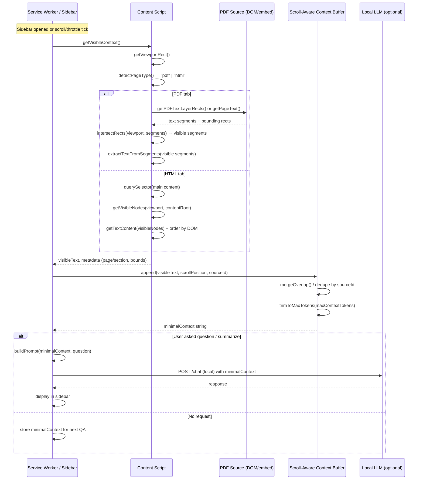
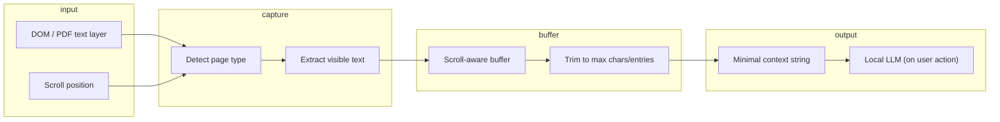

# BioScriptAI — Screen Inference Pipeline Design

Design for a scroll-aware pipeline that detects the currently visible portion of an academic paper, builds a minimal context buffer, and sends only what’s needed to the LLM. Uses browser DOM and PDF text extraction; defaults to local processing and privacy-safe behavior.

---

## 1. Pipeline Overview

```
[Page: PDF or HTML] → Capture visible viewport → Identify content source
       → Extract text for visible region → Update scroll-aware buffer
       → Trim to minimal context → (Optional) Send to local LLM
```

- **Inputs:** Active tab (PDF viewer or HTML article), scroll position, viewport size.
- **Outputs:** Minimal context string (and optionally viewport metadata) for the QA/summarization agent.
- **Privacy:** No data leaves the machine unless user opts in; local LLM and local buffer only by default.

---

## 2. Sequence Diagram



---

## 3. Detailed Sequence (Scroll / Throttle)

```mermaid
sequenceDiagram
    participant User
    participant Sidebar
    participant Scheduler
    participant ContentScript
    participant Buffer

    User->>Sidebar: Opens sidebar or scrolls
    Sidebar->>Scheduler: scheduleCapture(delayMs)
    Note over Scheduler: Throttle: e.g. 300ms

    Scheduler->>ContentScript: captureVisible()
    ContentScript->>ContentScript: getBoundingClientRect() + scrollY
    ContentScript->>ContentScript: extractVisibleText()
    ContentScript-->>Sidebar: VisibleChunk { text, pageIndex, yRange }

    Sidebar->>Buffer: update(chunk, scrollPosition)
    Buffer->>Buffer: addToBuffer(chunk)
    Buffer->>Buffer: trimToLength(maxChars)
    Buffer-->>Sidebar: bufferId (no network)

    Note over Sidebar,Buffer: All processing local; LLM only on user action
```

---

## 4. Pseudocode

### 4.1 Entry: When to Run the Pipeline

```
ON Sidebar opened OR Tab activated (paper URL):
    IF user preference allows screen inference AND (page is PDF or HTML article):
        START pipeline
        REGISTER scroll listener (throttled, e.g. 300 ms)
        REGISTER resize listener (throttled)

ON Scroll or Resize (throttled):
    REQUEST visible context from content script
    UPDATE scroll-aware buffer with result
    (Do NOT call LLM here — buffer is for next user question)
```

### 4.2 Content Script: Detect Source and Extract Visible Text

```
FUNCTION getVisibleContext() -> VisibleChunk:
    viewport <- getViewportRect()           // { top, left, width, height, scrollY }
    pageType <- detectPageType()           // "pdf" | "html" | "unsupported"

    IF pageType = "pdf":
        RETURN extractVisibleFromPDF(viewport)
    ELSE IF pageType = "html":
        RETURN extractVisibleFromHTML(viewport)
    ELSE:
        RETURN VisibleChunk(null, "unsupported")
```

### 4.3 PDF: Visible Portion Only

```
FUNCTION extractVisibleFromPDF(viewport) -> VisibleChunk:
    // Assume PDF viewer exposes text layer (e.g. divs with .textLayer span) or we have
    // a text map from prior full-page extraction (pageIndex -> list of (rect, text)).
    textLayer <- document.querySelector(".textLayer") OR getPDFTextMap()

    IF textLayer exists (DOM):
        spans <- textLayer.querySelectorAll("span")
        visibleSpans <- []
        FOR each span IN spans:
            rect <- span.getBoundingClientRect()
            IF intersects(rect, viewport):
                visibleSpans.append(span)
        visibleSpans <- sortBy(visibleSpans, top-to-bottom, left-to-right)
        text <- join(textContent(visibleSpans), " ")
        pageIndex <- getPageNumberForViewport(viewport)  // from viewer API or heuristic
        RETURN VisibleChunk(text, pageIndex, viewport.scrollY, "pdf")
    ELSE IF textMap from prior extraction:
        visibleSegments <- segmentsInViewport(textMap, viewport)
        text <- join(visibleSegments.text, " ")
        RETURN VisibleChunk(text, visibleSegments.pageIndex, viewport.scrollY, "pdf")
    ELSE:
        RETURN VisibleChunk(null, null, null, "pdf_no_text")
```

### 4.4 HTML: Visible Section Only

```
FUNCTION extractVisibleFromHTML(viewport) -> VisibleChunk:
    root <- document.querySelector("[data-bioscript-main]") OR "article" OR "[role=main]"
    IF root is null: RETURN VisibleChunk(null, "no_content")

    visibleNodes <- []
    FOR each node IN walkTextNodes(root):
        rect <- node.getBoundingClientRect()
        IF rect is empty: CONTINUE  // e.g. hidden
        IF intersects(rect, viewport):
            visibleNodes.append(node)
    // Optional: collapse to block level (paragraphs) to avoid broken mid-word
    blocks <- groupIntoBlocks(visibleNodes)
    text <- join(getTextContent(blocks), "\n\n")
    sectionId <- getSectionId(blocks)  // e.g. heading or data-section
    RETURN VisibleChunk(text, sectionId, viewport.scrollY, "html")
```

### 4.5 Scroll-Aware Context Buffer

```
STATE:
    buffer: List<BufferEntry>   // ordered by scroll position / time
    maxChars: Int              // e.g. 6000
    maxEntries: Int            // e.g. 5
    sourceId: String           // tab URL or paper id for dedupe

STRUCT BufferEntry:
    text: String
    scrollY: Number
    pageOrSection: String | Int
    source: "pdf" | "html"
    timestamp: Number

FUNCTION updateBuffer(chunk: VisibleChunk):
    IF chunk.text is null or empty: RETURN
    entry <- BufferEntry(chunk.text, chunk.scrollY, chunk.pageOrSection, chunk.source, now())
    buffer.append(entry)
    mergeOverlappingEntries()   // same page/section, adjacent scroll -> one entry
    dedupeBySource(sourceId)    // keep one representative per source when similar
    trimToMaxEntries(maxEntries)
    trimToMaxChars(maxChars)    // from oldest entries first
```

### 4.6 Minimal Context for LLM

```
FUNCTION getMinimalContextForLLM() -> String:
    IF buffer is empty: RETURN ""
    // Prefer latest (current view); add older entries only if under limit
    sorted <- buffer.sortedBy(descending timestamp)
    total <- 0
    parts <- []
    FOR entry IN sorted:
        IF total + len(entry.text) > maxChars: BREAK
        parts.prepend(entry.text)   // so order is chronological/scroll order
        total += len(entry.text)
    RETURN join(parts, "\n\n---\n\n")
```

### 4.7 Privacy and Local Defaults

```
CONFIG (defaults):
    screenInferenceEnabled: true
    processLocallyOnly: true      // no cloud; use local LLM only
    persistBufferInMemoryOnly: true  // do not write raw page text to disk
    maxContextToSend: 6000        // chars; minimize what goes to LLM

BEFORE sending anything to any API:
    IF NOT processLocallyOnly AND user has not consented to "allow cloud":
        ABORT and show message: "Screen context is only used with local LLM by default."
    IF len(minimalContext) > maxContextToSend:
        minimalContext <- truncate(minimalContext, maxContextToSend, fromStart)
    DO NOT include: full page HTML, full PDF, or PII (detect and strip if needed)
```

---

## 5. Data Structures (Summary)

| Name | Purpose |
|------|--------|
| `Viewport` | `{ top, left, width, height, scrollY }` in client coordinates. |
| `VisibleChunk` | `{ text, pageOrSection, scrollY, source }` — one visible “window” of content. |
| `BufferEntry` | Same as chunk + `timestamp`; stored in buffer. |
| `Scroll-aware buffer` | Bounded list of `BufferEntry`; merged/deduped; trimmed by `maxChars` and `maxEntries`. |
| `minimalContext` | Single string from `getMinimalContextForLLM()` sent to the LLM. |

---

## 6. Privacy and Local Processing Checklist

- **Local by default:** Screen inference runs in the browser and (if needed) a local inference server; no automatic cloud.
- **Minimal context:** Only the output of `getMinimalContextForLLM()` is sent to the LLM; buffer is trimmed by character count and entry count.
- **No persistence of raw page:** Buffer lives in memory only unless user opts in to a “remember session” feature (then store only minimal context or hashes, not full text).
- **Explicit consent for cloud:** If a cloud LLM is ever supported, require an explicit “Allow sending context to cloud” option; default remains local.
- **PII:** Do not inject obvious PII (e.g. user’s name from the page) into prompts; optional lightweight strip step before `getMinimalContextForLLM()`.

---

## 7. Pipeline Diagram (High-Level)



---

**File:** `docs/SCREEN_INFERENCE_PIPELINE.md` — Use with the real-time screen inference component in the architecture; implement in content script (capture) and service worker/sidebar (buffer + LLM call).
